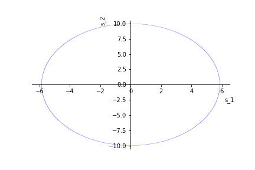
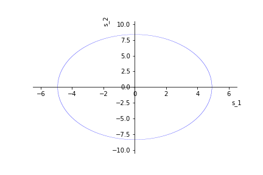

## 1. Comparing Two Populations 1 

A study of the differences in cognitive function between normal individuals and patients diagnosed with schizophrenia was published in the American Journal of Psychiatry (Apr.
2010). The total time (in minutes) a subject spent on the Trail Making Test (a standard psychological test) was used as a measure of cognitive function. The researchers theorize that the mean time on the Trail Making Test for schizophrenics will be larger than the corresponding mean for normal subjects. The data for independent random samples of 41 schizophrenics and 49 normal individuals yielded the following results:

\begin{center}
\begin{tabular}{l|cc} 
& Schizophrenia & Normal \\
\hline Sample size & 41 & 49 \\
Mean time & $104.23$ & $62.24$ \\
Standard deviation & $62.24$ & $16.34$
\end{tabular}
\end{center}

(a) Define the parameter of interest to the researchers.

(b) Set up the null and alternative hypothesis for testing the researchers' theory.

(c) The researchers conducted the test, part (b), and reported a $p$ -value of $.001$. What conclusions can you draw from this result? (Use $\alpha=0.01$ )

(d) Find a $99 \%$ confidence interval for the target parameter. Interpret the result. Does your conclusion agree with that of the previous part?

\textbf{Solution:}

(a) The parameter of interest is the difference in the mean time the subjects spent on the Trial Making Test. So we are interested in the parameter

$$
\mu_d = \mu_s - \mu_n
$$
where $\mu_n$ and $\mu_s$ are the mean times for normal individuals and patients with schizophrenia respectively.

(b) We want to test:

$$
H_0: \mu_d = 0 \quad vs. \quad H_1:\mu_d > 0
$$

(c) Since our $p$-value is small we reject the null at this level of $\alpha$. The conclusion is, that this favors the researchers theory.

(d) We have given a formula for the confidence interval in the lecture notes:

```{r}
n_1 = 41
n_2 = 49

x_1 = 104.23
x_2 = 62.24

s_1 = 62.24
s_2 = 16.34

z_ah = qnorm(1-0.01/2)

pm = z_ah*sqrt(s_1^2/n_1 + s_2^2/n_2)

paste("99% CI = [", x_1- x_2 - pm, ",",x_1 - x_2 + pm,"]")
```
This random interval contains our true target parameter with a $99\%$ confidence level. This conclusion agrees with the previous part in that it suggests that the difference in the means is positive.


## 2. Comparing Two Populations 2 

Suppose you wish to compare a new method of teaching reading to slow learners with the current standard method. You decide to base your comparison on the results of a reading test given at the end of a learning period of six months. Of a random sample of 22 slow learners, 10 are taught by the new method and 12 are taught by the standard method. All 22 children are taught by qualified instructors under similar conditions for the designated six-month period. The results of the reading test at the end of this period are given below.
New Method: $80,76,70,80,66,85,79,71,81,76$. Standard Method: $79,73,72,62,76,68,70,86,75,68,73,66$.

(a) Use the data in the table to estimate the true mean difference between the test scores for the new method and the standard method. Use a $95 \%$ confidence interval.

(b) Interpret the interval you found in the previous part.

(c) What assumptions must be made in order that the estimate be valid? Are they reasonably satisfied?

\textbf{Solution:}
Under the assumption of normality we will first do an F-Test to test

$$
H_0: \sigma_1^2 = \sigma_2^2 \quad vs. \quad H_1: \sigma_1^2 \neq \sigma_2^2
$$

```{r}
new_method = c(80,76,70,80,66,85,79,71,81,76)
old_method = c(79,73,72,62,76,68,70,86,75,68,73,66)

var.test(new_method, old_method)
```
The $p$-value is large so we will assume that the variances are equal and use the according formulas form the lecture notes.

```{r}
x_1 = mean(new_method)
x_2 = mean(old_method)

s_1 = var(new_method)
s_2 = var(old_method)

n_1 = length(new_method)
n_2 = length(old_method)

s_p = ((n_1 - 1)*s_1 + (n_2 - 1)*s_2) / (n_1 + n_2 - 2)

t_ah = qt(1-0.05/2,n_1 + n_2 -2)
pm = t_ah*sqrt(s_p*(1/n_1 + 1/n_2))

paste("95% CI = [", x_1 - x_2 - pm, ",", x_1 - x_2 + pm, "]")
```
We can do it a lot faster if we just use the inbuilt \texttt{R} function:

```{r}
t.test(new_method,old_method, var.equal = TRUE)
```
(b) The random interval from the previous part contains the true mean difference with a $95\%$ confidence level.

(c) The assumptions are that the sample size is small, which is a given. Another important one is the assumption of normality. This is especially important for the F-Test we did. From the F-Test we concluded another assumption: That the variances are equal. This assumption of normality is hard to check but it seems reasonable. Another assumption was the independence of the samples. 

## 3. Missing Information

An investigation of ethnic differences in reports of pain perception was presented at the annual meeting of the American Psychosomatic Society (Mar. 2001). A sample of 55 blacks and 159 whites participated in the study. Subjects rated (on a 13 -point scale) the intensity and unpleasantness of pain felt when a bag of ice was placed on their foreheads for two minutes. (Higher ratings correspond to higher pain intensity.) A summary of the results is provided in the following table.

\begin{center}
\begin{tabular}{l|cc} 
& Blacks & Whites \\
\hline Sample Size & 55 & 159 \\
Mean pain intensity & $8.2$ & $6.9$
\end{tabular}
\end{center}

(a) Why is it dangerous to draw a statistical inference from the summarized data? Explain.

(b) What values of the missing sample standard deviations would lead you to conclude (at $\alpha=0.05$ ) that blacks, on average, have a higher pain intensity rating than whites?

(c) What values of the missing sample standard deviations would lead you to an inconclusive decision (at $\alpha=0.05$ ) regarding whether blacks or whites have a higher mean intensity rating?

\textbf{Solution:}

(a) Only the mean is given and not the standard deviations. Those do play a very important role in our calculations and heavily influence our decision of rejecting the null.

(b) We test

$$
H_0 : \mu_1 - \mu_2 = 0 \quad vs. \quad H_1: \mu_1 - \mu_2 > 0
$$
with the test statistic

$$
z = \frac{\bar{x}_1 - \bar{x}_2}{\sqrt{\frac{s_1^2}{n_1} + \frac{s_2^2}{n_2}}}
$$

The $p$-value is $\mathbb{P}(Z > z)$ where $Z \sim \mathcal{N}(0,1)$. We would reject the null if the $p$-value is lower than $0.05$. With the $1-\alpha$ quantile $z_\alpha$ of the normal we can then reformulate this as a term in the variances:

$$
z_\alpha < \frac{\bar{x}_1 - \bar{x}_2}{\sqrt{\frac{s_1^2}{n_1} + \frac{s_2^2}{n_2}}}
\iff
\frac{s_1^2}{n_1} + \frac{s_2^2}{n_2} < \Big(\frac{\bar{x}_1 - \bar{x}_2}{z_\alpha}\Big)^2
\iff
\frac{s_1^2}{n_1 \Big(\frac{\bar{x}_1 - \bar{x}_2}{z_\alpha}\Big)^2} + \frac{s_2^2}{n_2\Big(\frac{\bar{x}_1 - \bar{x}_2}{z_\alpha}\Big)^2}   < 1
$$

This is the case for values of $s_1$ and $s_2$ that lie within the ellipsis as depicted below:

```{r}

```

(c) Here we are dealing with the two sided test

$$
H_0 : \mu_1 - \mu_2 = 0 \quad vs. \quad H_1: \mu_1 - \mu_2 \neq 0
$$

We are lead to an inconclusive decision if the $p$-value is greater (or equal to) $\alpha$. The $p$-value in this case is $2\mathbb{P}(Z\geq |z|) = 2\mathbb{P}(Z\geq z)$ since we know that $z$ is positive. This leads us to the inequality (where $z_{\alpha/2}$ is the $1-\alpha/2$ quantile of the standard normal)

$$
z_{\alpha/2} \geq \frac{\bar{x}_1 - \bar{x}_2}{\sqrt{\frac{s_1^2}{n_1} + \frac{s_2^2}{n_2}}}
$$

With the same calculations as above we can see that the values that lead to an inconclusive decision are the values on and outside the following ellipsis:

```{r}

```

## 4. $\chi^{2}$ -test for independence 

100 students from major mathematics of three Viennese universities were randomly chosen and asked which lecture, either a: calculus, b: algebra, or c: probability, they enjoyed most. The frequencies are given in the following table:

\begin{center}
\begin{tabular}{c|c|c|c} 
& Uni A & Uni B & Uni C \\
\hline calculus & 10 & 5 & 5 \\
\hline algebra & 10 & 20 & 10 \\
\hline probability & 20 & 5 & 15
\end{tabular}
\end{center}

Perform a $\chi^{2}$ -test to test whether the preference for a lecture is independent from the university, on a $5 \%$ significance level.

(a) Only use the following table which gives the $95 \%$ -quantile $q$ of the $\chi^{2}$ -distribution with df degrees of freedom.

\begin{center}
\begin{tabular}{c||c|c|c|c|c|c|c|c|c}
$d f$ & 1 & 2 & 3 & 4 & 5 & 6 & 7 & 8 & 9 \\
\hline$q$ & $3.84$ & $5.99$ & $7.81$ & $9.49$ & $11.07$ & $12.59$ & $14.07$ & $15.51$ & $16.92$
\end{tabular}
\end{center}

(b) Solve the previous exercise using $\texttt{R}$.

\textbf{Solution:}

## 5. Hypnosis 

Some researchers claim that susceptibility to hypnosis can be acquired or improved through training. To investigate this claim six subjects were rated on a scale of $1-20$ according to their initial susceptibility to hypnosis and then given 4 weeks of training. Each subject was rated again after the training period. In the ratings below, higher numbers represent greater susceptibility to hypnosis.

\begin{center}
\begin{tabular}{c|c|c}
\hline Subject & Before & After \\
\hline 1 & 10 & 18 \\
2 & 16 & 19 \\
3 & 7 & 11 \\
4 & 4 & 3 \\
5 & 7 & 5 \\
6 & 2 & 3 \\
\hline
\end{tabular}
\end{center}

Specify and perform the appropriate hypothesis test. What potential issues exist with this analysis?

\textbf{Solution:}


We will use the t-test for paired samples where we test

$$
H_0: \mu_d = 0 \quad vs. \quad H_1:\mu_d > 0
$$

First we will calculate the differences

\begin{center}
\begin{tabular}{c|c}
\hline Subject & Difference \\
\hline 1 & 8 \\
2 & 3 \\
3 & 4 \\
4 & -1 \\
5 & -2 \\
6 & 1 \\
\hline
\end{tabular}
\end{center}

We can then calculate the sample mean and variance

```{r}
d_arr = c(8,3,4,-1,-2,1)

d_bar = mean(d_arr)
s_d = sqrt(var(d_arr))

1 - pt(d_bar/(s_d/sqrt(6)),5)
```

The $p$-value is greater than our standard value so we cannot reject the null at a reasonable level. One issue might be that the sample size is very small. Another issue is that the t-test assumes normality.

Another test method that is non-parametric and thus has less assumptions on the distribution is the sign test. The sign test determines if one member of the pair tends to be greater than the other member. According to Wikipedia the sign test will usually have lower power then the t-test if the observations can be expressed as numeric quantities. The two sample sign test tests

$$
H_0: p = 0.5 \quad vs. \quad H_1: p > 0.5
$$
where $p = \mathbb{P}(X > Y)$.

We will only look at the sign of the difference

\begin{center}
\begin{tabular}{c|c}
\hline Subject & sign \\
\hline 1 & + \\
2 & + \\
3 & + \\
4 & - \\
5 & - \\
6 & + \\
\hline
\end{tabular}
\end{center}

If $P$ denotes the number of +-signs we know that under the null it holds that $P \sim Bin(6,0.5)$. We have observed 4 +-signs, so our $p$-value for this one sided test is

$$
\mathbb{P}(P \geq 4) = \sum_{i=4}^6 \binom{6}{i}0.5^i(1-0.5)^{6-i} = 0.5^6 \sum_{i=4}^6 \binom{6}{i} = 0.34375
$$
With this $p$-value we again can not reject the null at a reasonable level.

```{r}
binom.test(c(4,2),alternative = 'greater')
```
